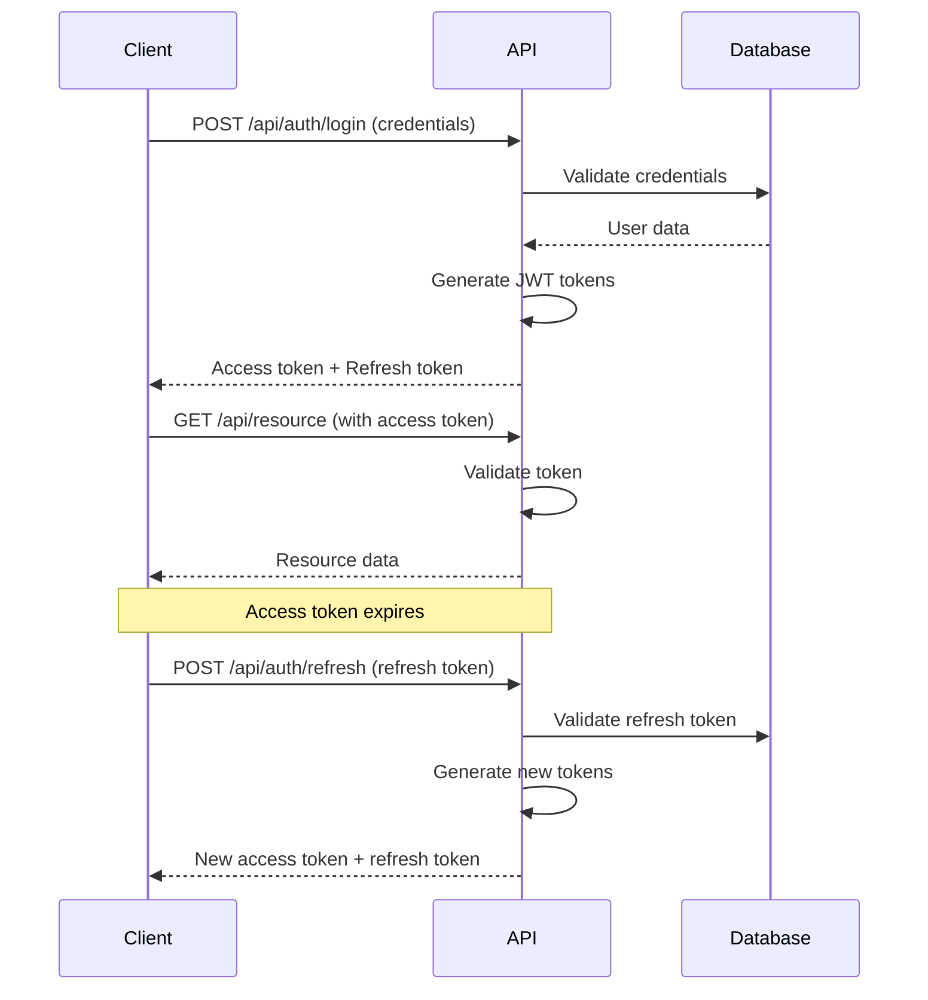
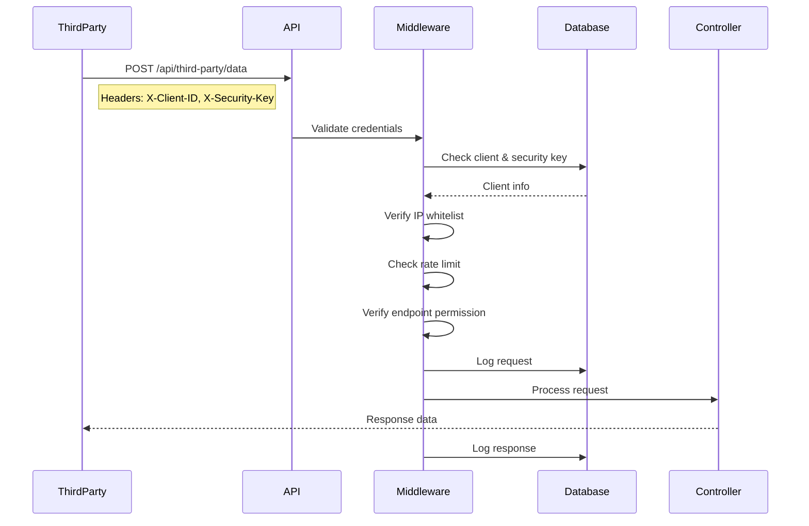

# Coherent Web Portal - API Documentation

## Base URL
- **Development**: `https://localhost:7001`
- **Production**: `https://api.coherent-web-portal.com`

---

## Authentication Endpoints

### 1. Login

**Endpoint**: `POST /api/auth/login`

**Description**: Authenticate user and receive JWT access token and refresh token.

**Request Body**:
```json
{
  "username": "admin",
  "password": "Admin@123"
}
```

**Success Response** (200 OK):
```json
{
  "isSuccess": true,
  "message": "Login successful",
  "accessToken": "eyJhbGciOiJIUzI1NiIsInR5cCI6IkpXVCJ9.eyJuYW1laWQiOiI...",
  "refreshToken": "YWJjZGVmZ2hpamtsbW5vcHFyc3R1dnd4eXoxMjM0NTY3ODkw...",
  "accessTokenExpiry": "2024-12-03T15:00:00Z",
  "refreshTokenExpiry": "2024-12-10T14:00:00Z",
  "user": {
    "id": "3fa85f64-5717-4562-b3fc-2c963f66afa6",
    "username": "admin",
    "email": "admin@coherent.local",
    "firstName": "System",
    "lastName": "Administrator",
    "phoneNumber": "+971501234567",
    "isActive": true,
    "roles": ["Admin"],
    "permissions": ["Users.Create", "Users.Read", "Users.Update", "Users.Delete", ...]
  }
}
```

**Error Response** (401 Unauthorized):
```json
{
  "message": "Invalid username or password"
}
```

---

### 2. Refresh Token

**Endpoint**: `POST /api/auth/refresh`

**Description**: Refresh expired access token using refresh token.

**Request Body**:
```json
{
  "refreshToken": "YWJjZGVmZ2hpamtsbW5vcHFyc3R1dnd4eXoxMjM0NTY3ODkw..."
}
```

**Success Response** (200 OK):
```json
{
  "isSuccess": true,
  "message": "Token refreshed successfully",
  "accessToken": "new-access-token",
  "refreshToken": "new-refresh-token",
  "accessTokenExpiry": "2024-12-03T16:00:00Z",
  "refreshTokenExpiry": "2024-12-10T15:00:00Z",
  "user": { ... }
}
```

**Error Response** (401 Unauthorized):
```json
{
  "message": "Invalid or expired refresh token"
}
```

---

### 3. Logout

**Endpoint**: `POST /api/auth/logout`

**Description**: Invalidate refresh token and log out user.

**Headers**:
```
Authorization: Bearer {access-token}
```

**Success Response** (200 OK):
```json
{
  "message": "Logout successful"
}
```

**Error Response** (401 Unauthorized):
```json
{
  "message": "Unauthorized"
}
```

---

### 4. Get Current User

**Endpoint**: `GET /api/auth/me`

**Description**: Get current authenticated user information.

**Headers**:
```
Authorization: Bearer {access-token}
```

**Success Response** (200 OK):
```json
{
  "id": "3fa85f64-5717-4562-b3fc-2c963f66afa6",
  "username": "admin",
  "email": "admin@coherent.local",
  "firstName": "System",
  "lastName": "Administrator",
  "phoneNumber": "+971501234567",
  "isActive": true,
  "roles": ["Admin"],
  "permissions": ["Users.Create", "Users.Read", ...]
}
```

---

## Audit Endpoints

### 1. Get Audit Logs

**Endpoint**: `GET /api/audit/logs`

**Description**: Retrieve audit logs for specified date range (Admin/Auditor only).

**Required Roles**: `Admin`, `Auditor`

**Headers**:
```
Authorization: Bearer {access-token}
```

**Query Parameters**:
- `from` (required): Start date (ISO 8601 format)
- `to` (required): End date (ISO 8601 format)
- `username` (optional): Filter by username

**Example Request**:
```
GET /api/audit/logs?from=2024-12-01T00:00:00Z&to=2024-12-03T23:59:59Z&username=admin
```

**Success Response** (200 OK):
```json
[
  {
    "id": "guid",
    "userId": "user-guid",
    "username": "admin",
    "action": "LOGIN_SUCCESS",
    "entityType": "User",
    "entityId": "user-guid",
    "oldValues": null,
    "newValues": null,
    "ipAddress": "192.168.1.100",
    "userAgent": "Mozilla/5.0...",
    "timestamp": "2024-12-03T14:30:00Z",
    "isSuccess": true,
    "errorMessage": null,
    "databaseSource": "Primary",
    "complianceCategory": "Authentication",
    "riskLevel": "Low"
  },
  ...
]
```

**Error Response** (403 Forbidden):
```json
{
  "message": "Access denied"
}
```

---

## Third-Party Integration Endpoints

### 1. Third-Party Data Endpoint

**Endpoint**: `POST /api/third-party/data`

**Description**: Secure endpoint for third-party system integration.

**Headers**:
```
X-Client-ID: hospital-system-a
X-Security-Key: your-security-key
Content-Type: application/json
```

**Request Body** (Example):
```json
{
  "query": "patient-data",
  "parameters": {
    "patientId": "12345",
    "dateFrom": "2024-01-01"
  }
}
```

**Success Response** (200 OK):
```json
{
  "message": "Data retrieved successfully",
  "timestamp": "2024-12-03T14:30:00Z",
  "client": {
    "isValid": true,
    "clientId": "guid",
    "clientName": "Hospital System A",
    "dataAccessLevel": "Read"
  },
  "data": { ... }
}
```

**Error Responses**:

**401 Unauthorized** (Missing credentials):
```json
{
  "error": "Missing client credentials"
}
```

**403 Forbidden** (Invalid credentials):
```json
{
  "error": "Invalid security key"
}
```

**429 Too Many Requests** (Rate limit exceeded):
```json
{
  "error": "Rate limit exceeded"
}
```

---

### 2. Third-Party Health Check

**Endpoint**: `GET /api/third-party/health`

**Description**: Health check endpoint for third-party systems.

**Headers**:
```
X-Client-ID: hospital-system-a
X-Security-Key: your-security-key
```

**Success Response** (200 OK):
```json
{
  "status": "healthy",
  "timestamp": "2024-12-03T14:30:00Z"
}
```

---

## Health Check Endpoints

### 1. API Health

**Endpoint**: `GET /api/health`

**Description**: Public health check endpoint.

**Success Response** (200 OK):
```json
{
  "status": "healthy",
  "timestamp": "2024-12-03T14:30:00Z",
  "service": "Coherent Web Portal",
  "version": "1.0.0"
}
```

---

### 2. System Health

**Endpoint**: `GET /health`

**Description**: Detailed system health check (includes database connectivity).

**Success Response** (200 OK):
```
Healthy
```

**Unhealthy Response** (503 Service Unavailable):
```
Unhealthy
```

---

## Error Responses

### Standard Error Format

All error responses follow this format:

```json
{
  "message": "Error description",
  "errors": {
    "field1": ["Error message 1", "Error message 2"],
    "field2": ["Error message"]
  }
}
```

### HTTP Status Codes

- `200 OK`: Request successful
- `201 Created`: Resource created successfully
- `400 Bad Request`: Invalid request data
- `401 Unauthorized`: Authentication required or failed
- `403 Forbidden`: Insufficient permissions
- `404 Not Found`: Resource not found
- `429 Too Many Requests`: Rate limit exceeded
- `500 Internal Server Error`: Server error

---

## Rate Limiting

### Global Rate Limit

- **Limit**: 100 requests per minute per IP address
- **Response**: 429 Too Many Requests

### Third-Party Rate Limit

- **Limit**: Configurable per client (default: 60 requests per minute)
- **Response**: 429 Too Many Requests

---

## Authentication Flow

### Standard User Flow



### Third-Party Flow



---

## Security Headers

All responses include these security headers:

```http
X-Content-Type-Options: nosniff
X-Frame-Options: DENY
X-XSS-Protection: 1; mode=block
Strict-Transport-Security: max-age=31536000; includeSubDomains
Content-Security-Policy: default-src 'self'
```

---

## CORS Policy

### Allowed Origins

Configured in `appsettings.json`:
```json
"Cors": {
  "AllowedOrigins": [
    "https://localhost:5173",
    "https://your-frontend-domain.com"
  ]
}
```

### CORS Headers

- **Allowed Methods**: GET, POST, PUT, DELETE, OPTIONS
- **Allowed Headers**: All
- **Credentials**: Allowed

---

## Postman Collection

### Import Instructions

1. Open Postman
2. Click Import
3. Select `Coherent_Web_Portal.postman_collection.json`
4. Configure environment variables:
   - `baseUrl`: API base URL
   - `accessToken`: JWT access token (auto-set after login)

### Environment Variables

```json
{
  "baseUrl": "https://localhost:7001",
  "accessToken": "",
  "refreshToken": "",
  "clientId": "hospital-system-a",
  "securityKey": "your-security-key"
}
```

---

## Sample Requests (cURL)

### Login
```bash
curl -X POST https://localhost:7001/api/auth/login \
  -H "Content-Type: application/json" \
  -d '{"username":"admin","password":"Admin@123"}'
```

### Get Current User
```bash
curl -X GET https://localhost:7001/api/auth/me \
  -H "Authorization: Bearer YOUR_ACCESS_TOKEN"
```

### Get Audit Logs
```bash
curl -X GET "https://localhost:7001/api/audit/logs?from=2024-12-01T00:00:00Z&to=2024-12-03T23:59:59Z" \
  -H "Authorization: Bearer YOUR_ACCESS_TOKEN"
```

### Third-Party Request
```bash
curl -X POST https://localhost:7001/api/third-party/data \
  -H "X-Client-ID: hospital-system-a" \
  -H "X-Security-Key: your-security-key" \
  -H "Content-Type: application/json" \
  -d '{"query":"patient-data","parameters":{}}'
```

---

## Swagger Documentation

Interactive API documentation available at:
- **Development**: https://localhost:7001/swagger
- **Production**: https://api.coherent-web-portal.com/swagger

---

## Versioning

Current Version: **v1**

API versioning will be implemented in future releases using URL versioning:
- v1: `/api/v1/...`
- v2: `/api/v2/...`

---

## Support

For API support and questions:
- Email: api-support@coherent.local
- Documentation: https://docs.coherent-web-portal.com
