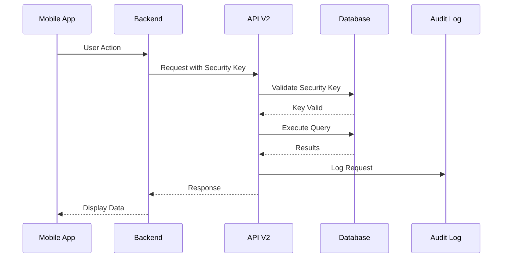
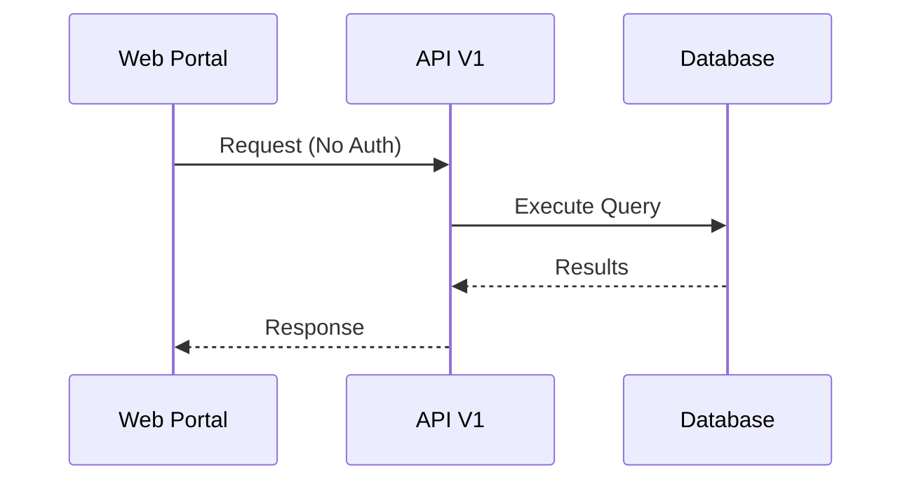

# API Versioning Guide

## Overview
The Coherent Web Portal API now supports **two versions**:

- **Version 1 (V1)**: For Web Portal - No authentication required
- **Version 2 (V2)**: For Mobile App Backend - Requires Security Key authentication

---

## 🔑 Version Comparison

| Feature | Version 1 | Version 2 |
|---------|-----------|-----------|
| **Purpose** | Web Portal | Mobile App Backend |
| **Authentication** | None (AllowAnonymous) | Security Key (X-Security-Key header) |
| **Base URL** | `/api/v1/` | `/api/v2/` |
| **Swagger Doc** | V1 - Web Portal (JWT Auth) | V2 - Mobile App (Security Key Auth) |
| **Use Case** | Direct web portal access | Mobile app backend integration |

---

## 📍 API Endpoints

### Version 1 - Web Portal (No Auth)

#### Patients
- `GET /api/v1/Patients/search`
- `GET /api/v1/Patients/{mrNo}`
- `GET /api/v1/Patients`

#### Appointments (V1 - Not available, only in V2)

---

### Version 2 - Mobile App (Security Key Required)

#### Appointments
- `GET /api/v2/Appointments/GetAllAppointmentByMRNO?MRNO={mrNo}`
- `GET /api/v2/Appointments/GetAvailableSlotOfDoctor?doctorId={id}&fromDate={date}&toDate={date}`
- `POST /api/v2/Appointments/BookAppointment`
- `POST /api/v2/Appointments/ChangeBookedAppointment`

#### Doctors
- `GET /api/v2/Doctors/GetAllDoctors`
- `GET /api/v2/Doctors/{doctorId}`

#### Patient Health
- `GET /api/v2/PatientHealth/GetVitalSignsByMRNO?MRNO={mrNo}`
- `GET /api/v2/PatientHealth/GetMedicationsByMRNO?MRNO={mrNo}`
- `GET /api/v2/PatientHealth/GetAllergyByMRNO?MRNO={mrNo}`

---

## 🔐 Version 2 Authentication

### Security Key Setup

Version 2 requires a **Security Key** in the request header.

#### Step 1: Generate Security Key

Run the SQL script to insert a third-party client:

```sql
INSERT INTO ThirdPartyClients (
    ClientName, 
    SecurityKey, 
    IsActive, 
    AllowedIPAddresses, 
    RateLimitPerMinute
)
VALUES (
    'Mobile App Backend',
    'YOUR_SECURE_GENERATED_KEY_HERE',  -- Generate a strong key
    1,  -- Active
    NULL,  -- All IPs allowed (or specify: '192.168.1.100,10.0.0.5')
    100  -- 100 requests per minute
);
```

#### Step 2: Use Security Key in Requests

Add the `X-Security-Key` header to all Version 2 API calls:

**cURL Example**:
```bash
curl -X GET "https://localhost:7001/api/v2/Appointments/GetAllAppointmentByMRNO?MRNO=1007" \
  -H "X-Security-Key: YOUR_SECURE_GENERATED_KEY_HERE" \
  -k
```

**JavaScript Example**:
```javascript
const response = await fetch(
  'https://localhost:7001/api/v2/Appointments/GetAllAppointmentByMRNO?MRNO=1007',
  {
    headers: {
      'X-Security-Key': 'YOUR_SECURE_GENERATED_KEY_HERE'
    }
  }
);
```

**C# Example**:
```csharp
using var client = new HttpClient();
client.DefaultRequestHeaders.Add("X-Security-Key", "YOUR_SECURE_GENERATED_KEY_HERE");

var response = await client.GetAsync(
    "https://localhost:7001/api/v2/Appointments/GetAllAppointmentByMRNO?MRNO=1007"
);
```

**Postman**:
1. Open Postman
2. Create new request
3. Add header: `X-Security-Key` = `YOUR_SECURE_GENERATED_KEY_HERE`
4. Send request to V2 endpoint

---

## 📱 Swagger UI

### Accessing Swagger

Navigate to: **https://localhost:7001/swagger**

### Swagger Features

You'll see a **dropdown** at the top-right with two options:

1. **V1 - Web Portal (JWT Auth)**
   - Shows all V1 endpoints
   - No authentication required
   - Direct testing available

2. **V2 - Mobile App (Security Key Auth)**
   - Shows all V2 endpoints
   - Requires Security Key
   - Click "Authorize" button to add security key

### Testing in Swagger

#### For Version 1 (No Auth):
1. Select "V1 - Web Portal (JWT Auth)" from dropdown
2. Expand any endpoint
3. Click "Try it out"
4. Enter parameters
5. Click "Execute"

#### For Version 2 (With Security Key):
1. Select "V2 - Mobile App (Security Key Auth)" from dropdown
2. Click **"Authorize"** button (lock icon)
3. In **SecurityKey** section, enter your security key
4. Click "Authorize"
5. Click "Close"
6. Now test endpoints as normal

---

## 🔄 Versioning Methods

The API supports **three** ways to specify the version:

### 1. URL Segment (Recommended)
```
GET /api/v1/Patients/search
GET /api/v2/Appointments/GetAllAppointmentByMRNO
```

### 2. Query String
```
GET /api/Patients/search?api-version=1.0
GET /api/Appointments/GetAllAppointmentByMRNO?api-version=2.0
```

### 3. HTTP Header
```
GET /api/Patients/search
Headers: X-Api-Version: 1.0

GET /api/Appointments/GetAllAppointmentByMRNO
Headers: X-Api-Version: 2.0
```

**Recommended**: Use URL segment method (`/api/v1/`, `/api/v2/`) for clarity.

---

## 🛡️ Security Features

### Version 1 (Web Portal)
- ✅ No authentication required
- ✅ Rate limiting: 100 requests/minute per IP
- ✅ CORS enabled for configured origins
- ✅ HTTPS enforced

### Version 2 (Mobile App)
- ✅ Security Key validation
- ✅ IP whitelisting support
- ✅ Rate limiting per client: Configurable in database
- ✅ Audit logging for all requests
- ✅ Request/Response logging
- ✅ HTTPS enforced

---

## 📊 Example Workflows

### Mobile App Backend Workflow



### Web Portal Workflow



---

## 🧪 Testing Both Versions

### Test Script (PowerShell)

```powershell
# Version 1 - Web Portal (No Auth)
$v1Response = Invoke-RestMethod -Uri "https://localhost:7001/api/v1/Patients?pageNumber=1&pageSize=5" -SkipCertificateCheck
Write-Host "V1 Response: $($v1Response.patients.Count) patients"

# Version 2 - Mobile App (With Security Key)
$headers = @{
    "X-Security-Key" = "YOUR_SECURE_GENERATED_KEY_HERE"
}
$v2Response = Invoke-RestMethod -Uri "https://localhost:7001/api/v2/Appointments/GetAllAppointmentByMRNO?MRNO=1007" -Headers $headers -SkipCertificateCheck
Write-Host "V2 Response: $($v2Response.Count) appointments"
```

### Test Script (Bash)

```bash
#!/bin/bash

# Version 1 - Web Portal (No Auth)
echo "Testing V1..."
curl -X GET "https://localhost:7001/api/v1/Patients?pageNumber=1&pageSize=5" -k

# Version 2 - Mobile App (With Security Key)
echo "Testing V2..."
curl -X GET "https://localhost:7001/api/v2/Appointments/GetAllAppointmentByMRNO?MRNO=1007" \
  -H "X-Security-Key: YOUR_SECURE_GENERATED_KEY_HERE" \
  -k
```

---

## 🔧 Configuration

### appsettings.json

No special configuration needed for versioning. Existing settings apply:

```json
{
  "Cors": {
    "AllowedOrigins": [
      "https://localhost:5173",
      "https://localhost:3000",
      "http://localhost:4200"
    ]
  },
  "RateLimit": {
    "PermitLimit": 100,
    "Window": "00:01:00"
  }
}
```

### Database Configuration

Security keys are stored in `CoherentMobApp` database:

**Table**: `ThirdPartyClients`

| Column | Description |
|--------|-------------|
| ClientName | Mobile App Backend |
| SecurityKey | Generated secure key |
| IsActive | 1 = Active |
| AllowedIPAddresses | Comma-separated IPs (NULL = all allowed) |
| RateLimitPerMinute | Requests per minute limit |

---

## 📝 Migration Guide

### Existing V1 Users (Web Portal)
✅ **No changes needed**
- All existing `/api/Patients/*` endpoints still work
- URLs automatically redirect to `/api/v1/Patients/*`
- No authentication required

### New V2 Users (Mobile App)
1. Generate and store security key in database
2. Update mobile app backend to use `/api/v2/*` endpoints
3. Add `X-Security-Key` header to all requests
4. Test endpoints in Swagger

---

## ⚠️ Important Notes

1. **Version 2 Security Key is REQUIRED**
   - All V2 requests without valid security key will return `401 Unauthorized`
   - Security key is validated against `ThirdPartyClients` table

2. **Rate Limiting**
   - V1: Global 100 requests/minute per IP
   - V2: Configurable per client in database

3. **Audit Logging**
   - V2 requests are logged to `ThirdPartyRequestLogs` table
   - Includes timestamp, IP, endpoint, response time

4. **IP Whitelisting**
   - V2 supports IP whitelisting
   - Set `AllowedIPAddresses` in `ThirdPartyClients` table
   - NULL = all IPs allowed

---

## 🚀 Quick Start

### For Web Portal (V1)
```bash
# No setup needed - just call the API
curl -X GET "https://localhost:7001/api/v1/Patients?pageNumber=1" -k
```

### For Mobile App (V2)
```bash
# Step 1: Add security key to database
# (Run SQL INSERT script above)

# Step 2: Call API with security key
curl -X GET "https://localhost:7001/api/v2/Doctors/GetAllDoctors" \
  -H "X-Security-Key: YOUR_KEY" \
  -k
```

---

## 📞 Support

### Check Version Support
```bash
curl -I "https://localhost:7001/api/v1/Patients" -k
# Returns: api-supported-versions: 1.0
```

### Troubleshooting

**401 Unauthorized on V2**:
- ✅ Check security key is correct
- ✅ Verify key exists in database
- ✅ Check `IsActive = 1` in database
- ✅ Verify IP is whitelisted (if configured)

**404 Not Found**:
- ✅ Check version number in URL (`v1` or `v2`)
- ✅ Verify endpoint name is correct
- ✅ Check Swagger for correct endpoint path

---

## 📚 Additional Resources

- **Swagger UI**: https://localhost:7001/swagger
- **Appointment API Docs**: `APPOINTMENT_API_DOCUMENTATION.md`
- **Security Configuration**: `SECURITY_CONFIGURATION.md`
- **Setup Guide**: `SETUP_GUIDE.md`

---

## ✅ Version 1 vs Version 2 Summary

| | Version 1 | Version 2 |
|---|---|---|
| **URL** | `/api/v1/*` | `/api/v2/*` |
| **Auth** | None | Security Key |
| **Header** | - | `X-Security-Key` |
| **For** | Web Portal | Mobile App Backend |
| **Endpoints** | Patients | Appointments, Doctors, Health |
| **Rate Limit** | 100/min per IP | Per client (DB) |
| **Audit Log** | No | Yes |
| **IP Whitelist** | No | Yes (optional) |

---

**Your API is now fully versioned and ready for both web portal and mobile app integration!** 🎉
